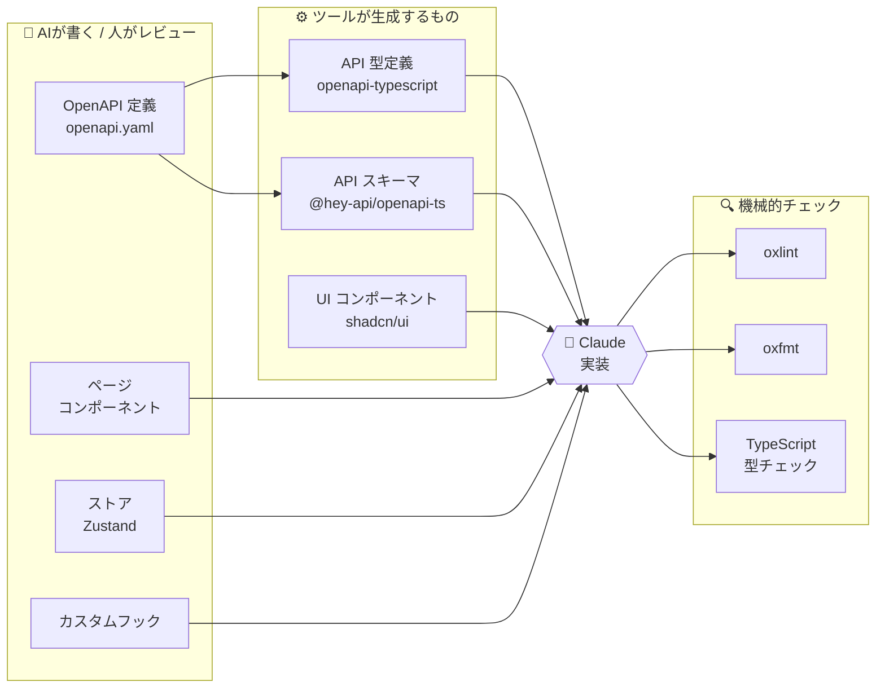

+++
title = "Claude 君と練ったフロントエンドアーキテクチャ"
date = "2026-03-14"
description = "Ox と Bun と React Compiler の時代"
[taxonomies]
tags = ["claude", "frontend", "react", "typescript"]
+++

[バックエンド編](@/dev/20260314_backend-with-claude.md)の続き。フロントエンド側の選定についても書いておく。

## ポリシー

バックエンド同様、以下を基本方針とした。

- なるべく宣言的
- なるべく自動生成ツールを活用
- AI が書きやすく、人がレビューしやすい構成

加えてフロントエンド固有のルールとして、AI が生成するコードのブレを減らすために攻めたコーディング規約を設けた。

## 技術スタック

| カテゴリ             | 技術                                     | バージョン   |
| -------------------- | ---------------------------------------- | ------------ |
| ランタイム           | Bun                                      | 最新安定版   |
| フレームワーク       | React                                    | 19.x         |
| ビルドツール         | Vite + Rolldown                          | 最新安定版   |
| 言語                 | TypeScript                               | 5.x (strict) |
| ルーティング         | React Router                             | v7           |
| サーバー状態管理     | TanStack Query                           | v5           |
| クライアント状態管理 | Zustand                                  | v5           |
| UIコンポーネント     | Radix UI + shadcn/ui                     | 最新安定版   |
| スタイリング         | Tailwind CSS                             | v4           |
| フォーム管理         | React Hook Form + Valibot                | v7 / v1      |
| API型生成            | openapi-typescript + @hey-api/openapi-ts | 最新安定版   |
| コード品質           | oxfmt / oxlint                           | 最新安定版   |

## 選定経緯

### [Bun](https://bun.sh/)

npm / yarn / pnpm ではなく Bun。速い。それだけで十分な理由になる。パッケージマネージャ、テストランナー、スクリプトランナーを一本化できるのも良い。

### [React](https://react.dev/) 19 + [Vite](https://vite.dev/) + [Rolldown](https://rolldown.rs/)

Next.js は今回不要。SPA で十分だし、SSR/SSG の複雑さを持ち込みたくなかった。CloudFront + S3 に置くだけのシンプルなデプロイにしたかった。

ビルドツールは Vite。バンドラが Rolldown に移行しつつあり、esbuild + Rollup の二重構成が解消されていく方向なのも良い。

### [React Compiler](https://react.dev/learn/react-compiler)

React 19 + React Compiler (Babel plugin) を有効化。これにより `useMemo` / `useCallback` の手動最適化が不要になった。AI にコードを書かせる上で「ここは memo 化すべきか」の判断を省けるのは大きい。

### [TanStack Query](https://tanstack.com/query) + [Zustand](https://zustand.docs.pmnd.rs/)

状態管理は「サーバー状態」と「クライアント状態」を明確に分離した。

- **サーバー状態（API データ）** → TanStack Query: キャッシュ、再取得、楽観的更新を一元管理
- **クライアント状態（UI の状態）** → Zustand: サイドバー開閉、選択中のテナントなど最小限の状態

Zustand にAPI呼び出しを持たせない。非同期は TanStack Query に任せる。この境界を明確にしておくと AI が迷わない。

### [shadcn/ui](https://ui.shadcn.com/) + [Radix UI](https://www.radix-ui.com/) + [Tailwind CSS](https://tailwindcss.com/) v4

UIコンポーネントは shadcn/ui を採用。Radix UI ベースでアクセシビリティが担保されており、コピペベースなのでカスタマイズが容易。Tailwind v4 との相性も良い。

CSS-in-JS は採用しない。Tailwind のユーティリティクラスで統一することで、AI が生成するスタイルの一貫性を保てる。

### [Valibot](https://valibot.dev/) + [React Hook Form](https://react-hook-form.com/)

バリデーションには Valibot を選択。[Zod](https://zod.dev/) でも良かったが、Valibot はツリーシェイキングに優れバンドルサイズが小さい。`InferOutput` で型を導出できるので手書きの型定義が不要。

### [openapi-typescript](https://openapi-ts.dev/) + [@hey-api/openapi-ts](https://heyapi.dev/)

バックエンドの OpenAPI 定義から TypeScript の型とクライアントスキーマを自動生成する。バックエンド記事で触れた oapi-codegen と同じ OpenAPI 定義が源泉になるので、フロント・バックで型の不整合が起きない。

### [oxlint + oxfmt](https://oxc.rs/)

ESLint + Prettier ではなく Ox 系に統一。圧倒的に速い。設定ファイルもシンプル。

Ox 系で以下の攻めたルールを設定した。

- `any` 型禁止（`unknown` + 型ガードで代替）
- `let` 原則禁止（`const` で統一）
- `function` 宣言禁止（アロー関数で統一）

tooling での強制が難しいものは規約として設けた。

- `for` / `while` 原則禁止（配列メソッドで代替）
- 過剰な関数分割の禁止（1画面1コンポーネント + ローカルヘルパーが基本）

AI に書かせると表現にブレが出やすい部分を機械的に潰す意図。選択肢を減らすことで生成コードの一貫性が上がる。

## 開発体験

バックエンド同様、OpenAPI 定義を起点に型を自動生成し、AI が実装、linter でチェックする流れ。

バックエンドほど自動生成の層は厚くないが、OpenAPI 起点の型生成と攻めた linter ルールで AI 生成コードの品質を担保している。コーディング規約で選択肢を絞ることで、レビュー時に「書き方の違い」ではなく「ロジックの正しさ」に集中できる。

## その他

この記事、途中で書くの疲れて claude に生成させました。
